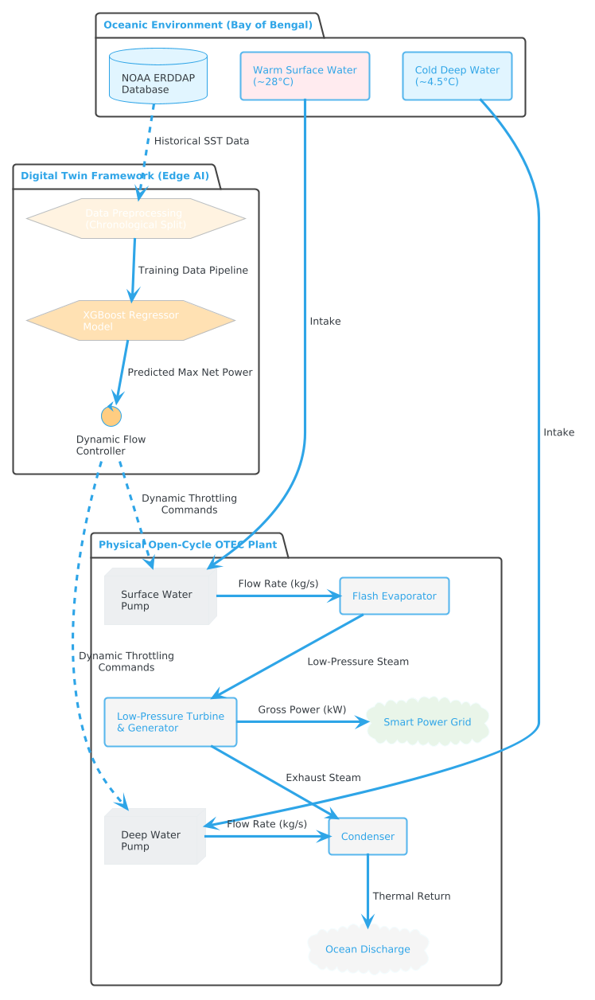
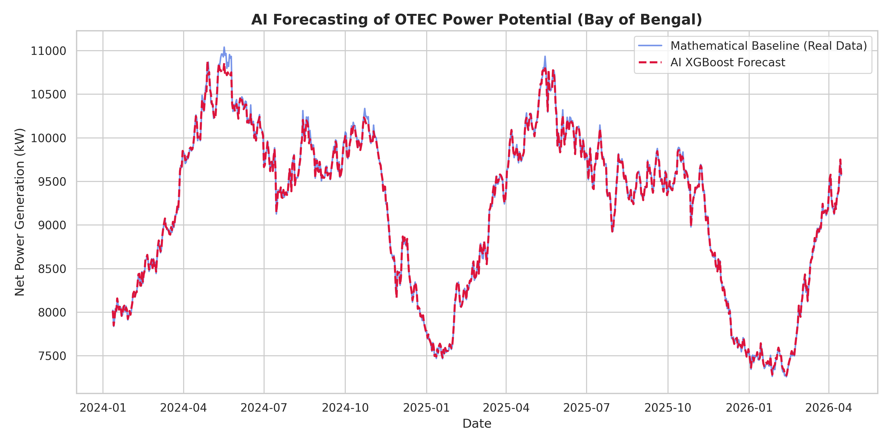
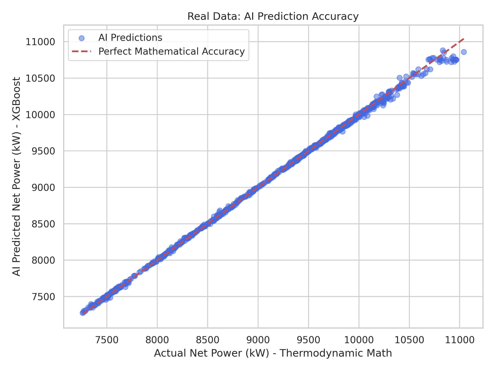

# AI-Integrated Digital Twin for OTEC Performance Optimization 🌊⚡

## 📌 Project Overview
Ocean Thermal Energy Conversion (OTEC) is a promising baseline renewable energy source that utilizes the thermal gradient between warm surface seawater and cold deep-ocean currents. However, its efficiency is highly sensitive to the volatile thermodynamic properties of surface weather.

This project introduces a novel **AI-integrated Digital Twin** designed to predict and optimize the Net Power output for an open-cycle OTEC plant located in the Bay of Bengal (Chennai, India). By leveraging an 11-year dataset of high-resolution Sea Surface Temperatures (SST) from NOAA and deploying an **eXtreme Gradient Boosting (XGBoost)** time-series forecasting model, this system allows smart grids to dynamically throttle massive seawater intake pumps, minimizing parasitic loads and maximizing sustainable net power.

## 🏗️ System Architecture
The framework bridges thermodynamic hardware and modern data science across three interconnected domains: the oceanic environment, the AI Digital Twin, and the physical plant hardware.

## ⚙️ Thermodynamic Modeling
To generate the target variables for AI training, a mathematical baseline defining the exact physics of the OTEC cycle was established:
1. **Carnot Efficiency:** Calculated using surface water ($T_w$) and deep water ($T_c$) temperatures.
2. **Gross Power:** Derived from thermal energy, mass flow rate, and mechanical turbine efficiency.
3. **Net Power:** The true power yield, calculated by subtracting the massive parasitic load required to pump water from 1,000 meters deep.

## 📊 Machine Learning Pipeline & Results
The Digital Twin processed 4,123 operational days of real-world historical data (2015–2026). A chronological train-test split (80/20) was enforced to prevent data leakage.

### Forecasting Accuracy
The XGBoost time-series forecaster achieved an extraordinary predictive accuracy:
* **Coefficient of Determination ($R^2$):** `99.82%`

### Visualizations
The model successfully mapped the complex, non-linear relationships of the plant's physics, capturing seasonal thermal oscillations to predict power yields months in advance.

**Time-Series Forecast:**

**Model Accuracy:**

## 📂 Repository Structure
* `OTEC_Digital_Twin_Forecaster.ipynb` : Google Colab Jupyter Notebook containing the data pipeline, thermodynamic calculations, and XGBoost training code.
* `subset.nc` : Cleaned dataset containing 11 years of localized oceanic temperatures and calculated power outputs.
* `Images/` : Contains architecture diagrams and matplotlib graphs used in the paper.

## 🚀 How to Run the Code
1. Clone this repository to your local machine or open it directly in Google Colab.
2. Ensure you have the required libraries installed: `pandas`, `numpy`, `matplotlib`, `seaborn`, `xarray`, `scikit-learn`, and `xgboost`.
3. Run the `OTEC_Digital_Twin_Forecaster.ipynb` notebook. The script will automatically read the `.csv` file, process the physics, and generate the forecasting visualizations.

## 👨‍💻 Authors
* **Dilraj Brar** - *Dept. of Computer Science and Engineering, SRMIST*
